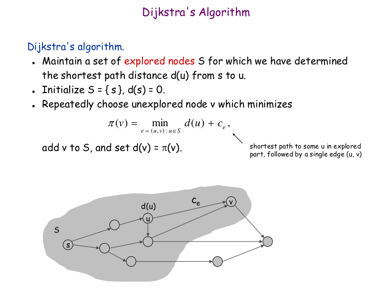
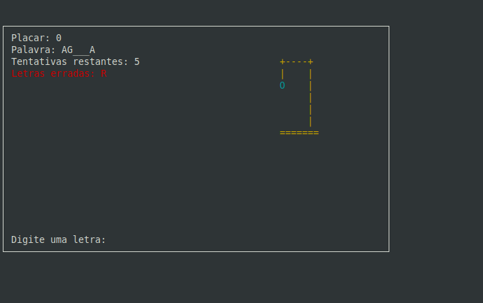

# Jogo da Forca

**Número da Lista**: 2<br>
**Conteúdo da Disciplina**: Grafos 2

## Aluno

| Matrícula | Aluno |
| -- | -- |
| 18/0125974 | [Lucas Rodrigues Monteiro](https://github.com/nickby2) |

## Sobre

E um projeto que implementa um jogo da forca em linguagem C. O objetivo do jogo é acertar a palavra antes que que erre 6 vezes e faça bonequinho da forca. Quando você erra as 6 vezes o jogo termina e você perde. 

## Grafo

Grafo de Djikstra que quando aperta H cria um modo de ajuda onde o proprio jogo te auxilia com as letras da forca.




## Video de Apresentação

[Apresentação]()


## Screenshots
<div class="ling" style="display: inline_block">
  <pre>           Forca              </pre>
    
</div>

## Instalação

**Linguagem:** C<br>
**Framework:** nenhum<br>
**Pré-requisitos:** Interpretador de C e o makefile. <br>

**Sistema Operacional** Linux mint<br>

## Observação

O makefile já está inserido no linux, mas se for em uma versão windows, ele vai precisar ser instalado. 

## Comandos para compilar o projeto

instalar o makefile:

```shell
sudo apt-get install make
``` 

Limpar o makefile:

```shell
make clean
``` 

compilar o projeto: 

```shell
make
``` 

Rodar o projeto: 

```shell
./forca
``` 